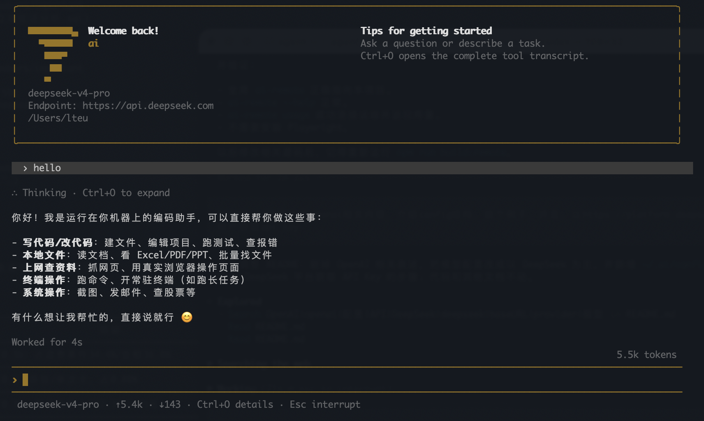

# ai-cli

`ai` 是一个本地优先的终端 Agent：在终端里提供可编辑的交互界面，并让模型通过工具读取文件、修改代码、执行命令、查看图片和操作浏览器。

模型层默认接入 DeepSeek API。终端、QQ 和个人微信共用同一套 Agent 引擎，但可以分别绑定模型。



## 主要能力

- 交互对话与 `ai ask` 单轮调用，支持流式输出、上下文压缩、任务队列、旁问和 Token 统计。
- 文件、Shell、图片、PDF、Excel、PowerPoint、网页抓取、浏览器自动化、MCP 和子 Agent 等工具。
- 命名模型预设，可为终端和各消息渠道独立切换。
- QQ、个人微信入口，以及邮件和美股/港股行情监控。
- Skills 渐进式加载：只在相关任务中把完整操作说明交给模型。

> `ai` 会在本机执行模型请求的文件和 Shell 操作，默认没有沙箱。只使用可信模型、提示词和 Skills，并在含敏感文件的目录中谨慎运行。

## 快速开始

需要 Node.js 20 或更高版本。

```bash
cd /path/to/agent
npm install
npm run build
npm link
```

构建后即可使用 `ai`。如果还需要托管密钥版本 `ai-remote`，请单独运行一次 `npm run build:remote` 生成其客户端和服务端产物。

### 获取并配置 DeepSeek API Key

1. 打开 [DeepSeek 开放平台](https://platform.deepseek.com/)，注册或登录账号。
2. 进入控制台的 API Keys 页面，创建一个新的 API Key。
3. 复制生成的 Key，并用下面的命令保存：

```bash
ai --set-key <你的 DeepSeek API Key>
ai --set-base-url https://api.deepseek.com
ai --set-model deepseek-v4-flash
ai --set-provider DeepSeek
```

API Key 会保存到 `~/.ai/config.json`，文件权限会被设置为仅当前用户可读写。不要把真实 Key 写入项目文件、提交到 Git 或发送给他人。模型名称如有变化，以 [DeepSeek API 文档](https://api-docs.deepseek.com/zh-cn/) 为准。

也可以使用环境变量临时覆盖配置：

```bash
export AI_API_KEY=<你的 DeepSeek API Key>
export AI_MODEL=deepseek-v4-flash
export AI_BASE_URL=https://api.deepseek.com
export AI_PROVIDER=DeepSeek
```

配置优先级是环境变量、`~/.ai/config.json`、代码默认值。运行 `ai --config` 可查看生效配置，其中 API Key 会被遮盖。

### 配置文件结构

`~/.ai/config.json` 由 `ai --set-*`、`ai --add-model` 和 `ai --use-model` 等命令自动维护。一个包含模型预设和渠道绑定的配置示例如下：

```json
{
  "apiKey": "sk-请替换为你的真实Key",
  "model": "deepseek-v4-flash",
  "baseURL": "https://api.deepseek.com",
  "provider": "DeepSeek",
  "activeModel": "deepseek-flash",
  "models": [
    {
      "name": "deepseek-flash",
      "model": "deepseek-v4-flash",
      "baseURL": "https://api.deepseek.com",
      "provider": "DeepSeek"
    },
    {
      "name": "deepseek-pro",
      "model": "deepseek-v4-pro",
      "baseURL": "https://api.deepseek.com",
      "provider": "DeepSeek"
    }
  ],
  "channelModels": {
    "qq": "deepseek-flash",
    "wx": "deepseek-pro"
  }
}
```

主要字段：

| 字段 | 作用 |
| --- | --- |
| `apiKey` | 默认 DeepSeek API Key |
| `model` | 当前默认模型 |
| `baseURL` | DeepSeek API 根地址，不包含 `/chat/completions` |
| `provider` | 界面和错误信息中显示的服务商名称 |
| `models` | 可按名字切换的模型预设列表 |
| `activeModel` | 当前默认预设的名字 |
| `channelModels` | QQ 和个人微信各自绑定的预设；未设置时继承默认模型 |

QQ、微信、SMTP 和行情监控等功能启用后，也会在同一个文件中增加各自的配置段。

### 开始使用

```bash
ai
ai ask "概括一下这个项目的结构"
ai ask --file question.txt
```

`ai ask` 把最终回答写到 stdout，进度和 Token 用量写到 stderr，适合脚本或管道。

## 模型预设与渠道绑定

经常切换服务商时，可以保存命名预设：

```bash
ai --add-model deepseek-flash model=deepseek-v4-flash baseURL=https://api.deepseek.com provider=DeepSeek
ai --add-model deepseek-pro model=deepseek-v4-pro baseURL=https://api.deepseek.com provider=DeepSeek

ai --list-models
ai --use-model deepseek-flash
ai --rm-model deepseek-pro
```

`model` 和 `baseURL` 必填；`apiKey` 和 `provider` 可省略。未提供 `apiKey` 时，切换预设会沿用当前全局 Key。

消息渠道可以独立绑定预设，长驻进程会在下一条消息时重新读取配置，无需重启：

```bash
ai --use-model deepseek-flash --channel qq
ai --use-model deepseek-pro --channel wx
```

`qq` 和 `wx` 分别表示 QQ 和个人微信。未绑定的渠道继承默认模型。也可以用 `AI_QQ_*`、`AI_WX_*` 环境变量单独覆盖 `API_KEY`、`MODEL`、`BASE_URL` 和 `PROVIDER`。

## 交互界面

运行中仍可提交下一条普通消息；它会进入可见队列，并在当前任务结束或被中断后按顺序执行。

| 输入或按键 | 作用 |
| --- | --- |
| `/models [序号或名字]` | 查看或切换模型预设 |
| `/btw <问题>` | 发起不打断主任务、无工具且不写入主历史的旁问 |
| `/usage` | 查看当前会话 Token 明细 |
| `/usage reset` | 清零当前会话计数 |
| `/mcp` | 查看当前目录生效的 MCP servers |
| `Ctrl+O` | 打开完整工具转录 |
| `Esc` | 生成中中断任务；编辑时清空输入 |
| `Ctrl+C` | 生成中中断；空闲时连续按两次退出 |
| 行尾 `\` 后按 Enter | 插入换行；也可直接粘贴多行文本 |

界面会自动检测浅色或深色终端背景。检测不正确时可用 `AI_THEME=light ai` 或 `AI_THEME=dark ai` 覆盖。

## 可选功能

### 浏览器自动化

浏览器工具是可选能力。首次使用前安装 Playwright 和 Chromium：

```bash
npm install --no-save playwright
npx playwright install chromium
```

随后直接描述任务即可，例如“打开这个页面并填写表单”。Agent 根据页面的文本快照选择元素，由 Playwright 完成导航、点击、填写、按键和截图。浏览器会话只存在于当前 `ai` 进程中。

### Skills

Skills 是带 frontmatter 的 Markdown 操作手册，按需加载以减少常驻上下文。支持两种位置：

| 位置 | 范围 |
| --- | --- |
| `~/.ai/skills/<name>/SKILL.md` | 当前用户的所有项目 |
| `<project>/.ai/skills/<name>/SKILL.md` | 当前项目；同名时覆盖用户级 Skill |

常用命令：

```bash
ai --skills
ai --skill-show <name>
ai --skill-new <name>
```

Skill 正文和附带脚本都会成为模型可执行的操作依据。安装第三方 Skill 前应完整审查其 `SKILL.md`、脚本、外部下载、密钥读取和持久化操作。

### MCP

`ai` 可以作为原生 MCP client 连接外部工具 server。配置格式兼容 Claude Code 的 `mcpServers`，支持 stdio、Streamable HTTP、旧版 SSE 和 WebSocket；Agent 会发现并调用 tools，读取 resources 和 prompts，处理清单变更通知，并把 server instructions 加入会话。工具名使用 `mcp__<server>__<tool>`，避免多个 server 冲突。

常用管理命令：

```bash
# stdio；默认 local scope，只对当前项目和本机生效
ai mcp add filesystem -- npx -y @modelcontextprotocol/server-filesystem .

# 只对当前项目生效，写入当前目录 .mcp.json
ai mcp add --scope project local-tools -- node ./tools/mcp-server.mjs

# Streamable HTTP；header 值可引用环境变量，避免把 token 明文写进配置
ai mcp add --transport http \
  -H 'Authorization: Bearer ${MCP_TOKEN}' \
  remote-tools https://example.com/mcp

# 标准 OAuth Authorization Code + PKCE（auth 也可写成 login）
ai mcp add --transport http company https://example.com/mcp
ai mcp auth company

# URL 参数写法会自动使用 HTTP transport
ai mcp add dcpv2 --url https://example.com/mcp/dcpv2

# WebSocket
ai mcp add --transport ws realtime wss://example.com/mcp

ai mcp list
ai mcp get remote-tools       # header/env 的值会遮盖
ai mcp test remote-tools      # 实际连接并列出发现的工具
ai mcp prompts remote-tools
ai mcp prompt remote-tools review target=src/mcp.ts
ai mcp logout company
ai mcp remove remote-tools
```

也可以直接写项目配置：

```json
{
  "mcpServers": {
    "local-tools": {
      "type": "stdio",
      "command": "node",
      "args": ["./tools/mcp-server.mjs"],
      "env": { "API_KEY": "${LOCAL_TOOLS_KEY}" }
    },
    "remote-tools": {
      "type": "http",
      "url": "https://example.com/mcp",
      "headers": { "Authorization": "Bearer ${MCP_TOKEN}" }
    }
  }
}
```

scope 分为 `local`、`user`、`project`：默认 `local` 存在 `~/.ai/config.json` 的当前项目分区，不污染仓库；`user` 对所有项目生效；`project` 写入可共享的 `.mcp.json`。项目配置会从文件系统上层到当前目录依次读取，越靠近当前目录优先级越高，local 最终覆盖同名配置。

字符串支持 `${VAR}` 和 `${VAR:-default}`；缺少必需环境变量时，该 server 不会启动，界面会显示原因。HTTP/SSE 支持静态 Header、`--headers-helper` 动态 Header，以及浏览器 OAuth 登录、动态客户端注册、token 刷新和 logout；凭据单独存放在权限为 `0600` 的 `~/.ai/mcp-auth.json`。可用 `disabled: true` 暂停某个 server，用 `AI_MCP_DISABLED=1` 暂时关闭全部 MCP；连接与调用超时可分别用 `AI_MCP_CONNECT_TIMEOUT_MS`、`AI_MCP_TOOL_TIMEOUT_MS` 调整。超大文本、音频和其他二进制结果会安全落盘到 `~/.ai/mcp-results`，避免塞满模型上下文。

MCP server 和本地工具一样拥有实际操作能力。只添加你信任的 server；共享 `.mcp.json` 时用环境变量引用密钥，不要提交明文 token。当前版本尚没有 Studio/CC 那种逐 server、逐工具审批规则，因此生产写操作应只暴露给可信会话。

### 消息渠道

所有消息渠道都能调用本地工具，因此白名单是安全边界，不应向不受信任的用户开放。

QQ 官方机器人：

```bash
ai --set-qq-app <AppID> <AppSecret>
ai serve
ai --qq-allow <openid>
```

先在 [QQ 开放平台](https://q.qq.com) 创建机器人。未授权用户发消息时只会收到自己的 `openid`；加入白名单并重启服务后才可使用 Agent。

个人微信：

```bash
ai wx-login
ai wx
ai --wx-allow <ilink_user_id>
```

`wx-login` 扫码绑定后，绑定账号本人默认进入白名单。凭据保存在 `~/.ai/config.json`。

在 macOS 上让 `serve`、`wx` 或 `watch` 登录后常驻，参见[通用 LaunchAgent 指南](docs/macos-launch-agent.md)。

### 邮件与行情监控

```bash
ai --set-smtp <邮箱> <应用专用密码> [host] [port]
ai email <收件人> <主题> <正文>

ai stock AAPL,TSLA
ai watch add AAPL above=300 below=250 chg=5 email=you@example.com
ai watch list
ai watch
```

`chg` 表示相对昨收的当日涨跌幅绝对值。`ai watch` 默认每 60 秒轮询；可用 `AI_STOCK_POLL`、`AI_STOCK_EMAIL`、`--set-stocks-notify` 和 `--set-stocks-email` 调整。


## 开发

```bash
npm run dev          # 直接运行源码
npm test             # 全部测试
npm run build        # 构建 ai
npm run build:remote # 构建 ai-remote 客户端与服务端
npm run pkg          # 生成 macOS .pkg
npm run dmg          # 生成 macOS .dmg
```

核心目录：

```text
src/agent/        Agent 循环、会话、压缩、验证和子 Agent
src/channels/     QQ、个人微信和行情监控
src/cli.tsx       ai 命令与终端界面
src/tools.ts      本地工具定义与执行
src/llm.ts        DeepSeek 模型请求与流式响应
src/remote*.ts    ai-remote 客户端与服务端
deploy/           Docker、systemd 和远端网关配置
test/             自动化测试
```

运行 `ai --help` 查看完整命令清单；涉及独立运行入口时，以对应的专门文档和 `--help` 为准。全部正式文档见 [`docs/README.md`](docs/README.md)，历史材料与截图见 [`assets/`](assets/)。
